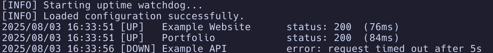

# 📈 Uptime Watchdog

[](https://opensource.org/licenses/MIT)
[](https://golang.org/)
[](https://goreportcard.com/report/github.com/seponik/uptime-watchdog)

A **lightweight**, **concurrent**, and **reliable** uptime monitoring tool built in Go. Monitor multiple endpoints simultaneously and get instant Slack notifications when services go down.

## ✨ Features

- 🔄 **Concurrent Monitoring** - Check multiple URLs simultaneously for optimal performance

- ⚡ **Lightning Fast** - Built with Go's goroutines for maximum efficiency  

- 📱 **Slack Integration** - Instant notifications to your team channels

- 📋 **YAML Configuration** - Simple, human-readable configuration files

- 🎯 **Minimal Resource Usage** - Designed to be lightweight and efficient

- 📊 **Response Time Tracking** - Monitor performance metrics

## 🚀 Quick Start

### Installation

1. Go to the [Releases](https://github.com/seponik/uptime-watchdog/releases) section of this repository.

2. Download the latest release for your operating system.

### Configuration

Create a `config.yaml` file:

```yaml
# Uptime Watchdog Configuration
webhook_url: https://hooks.slack.com/services/X/Y/Z

endpoints:
  - name: Portfolio
    url: https://me.seponik.dev
    timeout: 5s
    interval: 1h

  - name: Example API
    url: https://api.example.com/health
    timeout: 5s
    interval: 30m
    expected_status: 200
    
  - name: Example Website
    url: https://www.example.com
    timeout: 10s
    interval: 1h
    expected_status: 200
```

### Usage

```bash
./uwdog -config YOUR_CONFIG.yaml
```

## 📊 Sample Output




## 🔧 Configuration Options

### Application Configuration

| Parameter | Description | Required |
|-----------|-------------|----------|
| `webhook_url` | Slack webhook URL | ✅ |

### Endpoint Configuration

| Parameter | Description | Default | Required |
|-----------|-------------|---------|----------|
| `name` | Friendly name for the endpoint | - | ✅ |
| `url` | URL to monitor | - | ✅ |
| `interval` | Check interval (e.g., "30s", "2m") | "5m" | ❌ |
| `timeout` | Request timeout | "5s" | ❌ |
| `expected_status` | Expected HTTP status code | 200 | ❌ |


## 🐳 Docker Support

```bash
# Pull and run the latest version
docker run -v $(pwd)/config.yaml:/uwdog/config.yaml seponik/uwdog:latest
```

### Docker Compose

```yaml
version: '3.8'
services:
  uptime-watchdog:
    image: seponik/uwdog:latest
    volumes:
      - ./config.yaml:/uwdog/config.yaml
    restart: unless-stopped
```

## 🏗️ Building from Source

Clone the repository and build for your platform:

```bash
git clone https://github.com/seponik/uptime-watchdog.git
cd uptime-watchdog
make build OS=linux ARCH=amd64
```

### Supported Platforms

| OS | Architecture |
|---|---|
| `linux` | `amd64`, `arm64` |
| `windows` | `amd64`, `arm64` |
| `darwin` | `amd64`, `arm64` |

### Examples

```bash
# Linux x64
make build OS=linux ARCH=amd64

# macOS Apple Silicon
make build OS=darwin ARCH=arm64

# Windows x64
make build OS=windows ARCH=amd64
```

## 🤝 Contributing

We welcome contributions! Please see our [Contributing Guide](CONTRIBUTING.md) for details.
## 📝 License

This project is licensed under the MIT License - see the [LICENSE](LICENSE) file for details.